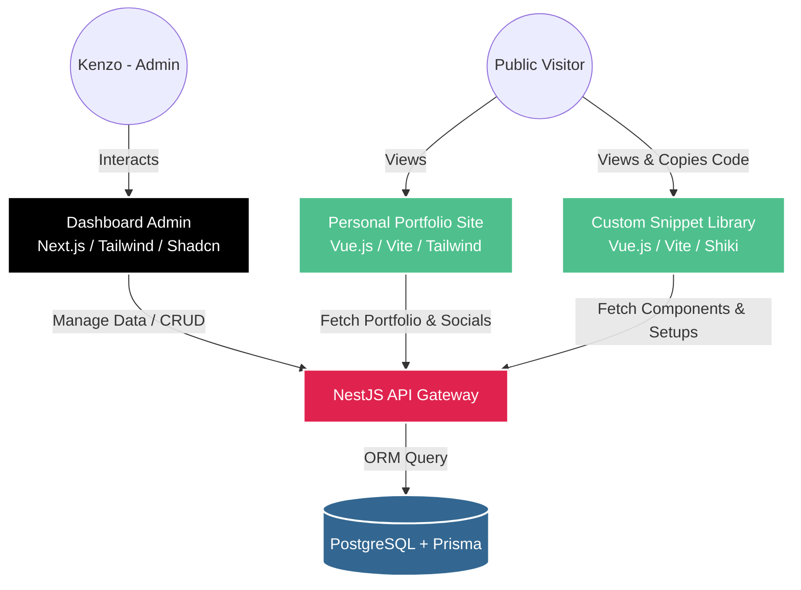
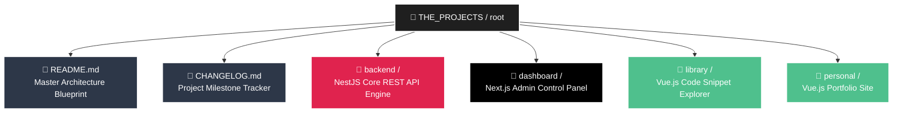

# 🚀 THE PROJECTS (Personal Portfolio & Custom Snippet Library)

Welcome to the **THE PROJECTS** master repository! This project is engineered as a decoupled **Monorepo** designed to unify personal digital identity, professional portfolio hosting, and a highly accessible, custom code-snippet manager.

Instead of hunting through old GitHub repositories for past configurations, reusable UI elements, or boilerplate integration codes (e.g., NextAuth setups, TanStack Query providers), this ecosystem centralizes everything into a custom-built, searchable library controlled by an administrative dashboard.

---

## 🏗️ System Architecture

The ecosystem relies on an asynchronous, decoupled architecture where a secure backend acts as the single source of truth, serving three isolated frontend platforms via highly optimized REST APIs.



---

## 📂 Repository Structure

This monorepo groups all micro-applications within distinct directories for modularity and ease of maintenance:



---

## 🛠️ Global Tech Stack Specification

| Module        | Core Technology      | Primary Packages / Tools                        | Purpose / Scope                                       |
| :------------ | :------------------- | :---------------------------------------------- | :---------------------------------------------------- |
| **Monorepo**  | Node.js (v20+)       | NPM Workspaces / Global Scripts                 | Workspace orchestration & package management          |
| **Backend**   | NestJS               | Prisma ORM, Passport.js, JWT, `class-validator` | Secure Core REST API & Database Control               |
| **Database**  | PostgreSQL           | Prisma Client, Prisma Studio                    | Persistent and relational data storage                |
| **Dashboard** | Next.js (App Router) | TanStack Query, Tailwind CSS, Shadcn UI         | Private Admin CRUD panel & dynamic content controller |
| **Library**   | Vue.js (Vite)        | Shiki/Prism.js, Pinia, Tailwind CSS             | High-performance code rendering & instant search      |
| **Personal**  | Vue.js (Vite)        | Vue Router, Tailwind CSS, Motion One            | Professional identity showcase & clean portfolio UI   |

---

## 🗺️ Environment Variables Matrix

Before launching the projects locally, each subdirectory requires specific configuration keys. Create a `.env` file inside each designated application folder matching the parameters below.

### 1. Backend Module Configuration

Create a `.env` file inside the `/backend` directory:

```env
PORT=5000
NODE_ENV=development
DATABASE_URL="postgresql://<db_user>:<db_password>@localhost:5432/<db_name>?schema=public"
JWT_SECRET="your_fallback_super_secure_jwt_secret_key"
JWT_EXPIRES_IN="7d"
CORS_ORIGIN="http://localhost:3000,http://localhost:5173,http://localhost:5174"
```

### 2. Dashboard Admin Module Configuration

Create a `.env.local file` inside the /dashboard directory:

```env
NEXT_PUBLIC_API_URL="http://localhost:5000/api/v1"
```

### 3. Custom Snippet Library Module Configuration

Create a `.env` file inside the `/library` directory:

```env
VITE_API_URL="http://localhost:5000/api/v1"
```

### 4. Personal Website Module Configuration

Create a `.env` file inside the `/personal` directory:

```env
VITE_API_URL="http://localhost:5000/api/v1"
```

---

## 🚀 Local Development Setup Instruction

Follow these sequential steps to bootstrap and spin up the entire ecosystem on your local environment.

### 1. System Requirements & Global Dependencies

Ensure you have the following software runtimes installed globally on your system:

- **Node.js**: `v20.x` or newer
- **Package Manager**: `NPM` (default) or `PNPM`
- **PostgreSQL Database**: `v15.x` or higher (Running locally via native installation or Docker instance)

### 2. Workspace Initialization

Clone the repository and install all node modules required by the monorepo workspace structure:

```bash
# Navigate to your workspace directory and install root dependencies
npm install
```

### 3. Database Migration & ORM Setup

Navigate into the backend service to generate your Prisma client schemas and push migrations into your PostgreSQL instance:

```bash
cd backend

# Generate Prisma Client TypeScript typings
npx prisma generate

# Create and apply development migration to your local database
npx prisma migrate dev --name init

# Optional: Spin up Prisma Studio GUI to view your tables natively
npx prisma studio
```

### 4. Running the Ecosystem Modules Locally

Open separate terminal tabs or split windows for each module inside the THE_PROJECTS workspace to initiate development servers:

```bash
# Terminal 1: Launch Core NestJS REST API Engine [Runs on Port 5000]
cd backend && npm run start:dev

# Terminal 2: Launch Next.js Dashboard Management Interface [Runs on Port 3000]
cd dashboard && npm run dev

# Terminal 3: Launch Vue.js Personal Website Landing Platform [Runs on Port 5173]
cd personal && npm run dev

# Terminal 4: Launch Vue.js Code Snippet Library Explorer [Runs on Port 5174]
cd library && npm run dev
```

---

## 🌟 Strategic Development Roadmap

To prevent architectural overhead, the development timeline is organized into isolated, functional deployment sprints:

- [ ] **Sprint 1: Database Architecture & Core API Auth**
  - Setup PostgreSQL schemas and Prisma definitions.
  - Secure NestJS modules with Passport.js and JWT interceptors.
  - Implement strict data payload validation.
- [ ] **Sprint 2: Administrative Control Unit**
  - Construct the main Dashboard layout using Next.js and Shadcn UI.
  - Integrate TanStack Query for seamless communication with the backend.
  - Build dynamic markdown-supported forms for code and project ingestion.
- [ ] **Sprint 3: Snippet Processing Engine & Explorer**
  - Deploy the Library catalog interface using Vue.js.
  - Embed Shiki syntax highlighting for beautiful code presentation.
  - Execute efficient search filters and one-click copy functionality.
- [ ] **Sprint 4: Identity Platform & Final Integration**
  - Animate and polish the dynamic Personal Website UI.
  - Wire up backend endpoints for automated portfolio and social link updates.
  - Execute optimal asset strategies for high-performance builds.

---

## 📝 Continuous Maintenance Log

All feature updates, patch implementations, and critical architectural modifications are safely logged in the central repository file. To track incremental development versions and deployment timelines chronologically, please review the complete documentation in [CHANGELOG.md](./CHANGELOG.md).
