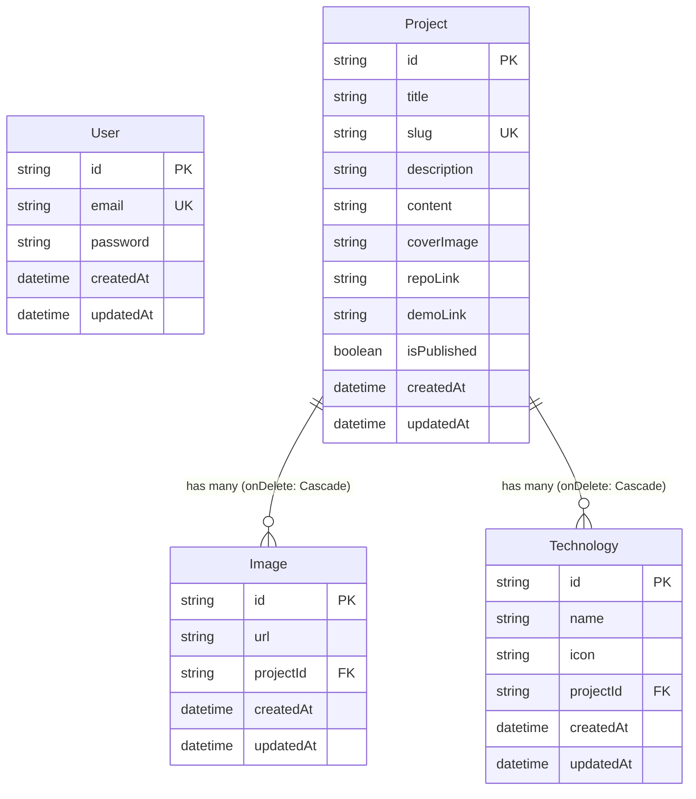

# 📁 Backend Service Engine (NestJS)

This directory houses the core REST API application powered by NestJS, Prisma ORM, and PostgreSQL. It serves as the single source of truth for all frontend clients within the ecosystem.

---

## 🏗️ Database Architecture & ERD (Entity-Relationship Diagram)

Below is the structured representation of the data models, attributes, data types, and core constraints managed via Prisma ORM and PostgreSQL.



---

## 📡 REST API Specifications & Endpoint Matrix

### 1. Administrative Authentication (/auth)

...

### 2. Portfolio Project Management (/projects)

...

### 3. Code Snippet Catalog (/snippets)

...

### 4. Dynamic Content & Social Links (/social-links)

...

---

## ⚙️ Module Internal Architecture

The NestJS application’s internal modular layout follows structural encapsulation design principles. Each domain contains its own Controller, Service, and DTO layers.

```plaintext
src/
├── auth/           # Auth controllers, JWT strategies, and Passport guards
├── user/           # User management and profile handling engine
├── snippets/       # Snippet business logic, validations, and DTO layouts
├── projects/       # Portfolio projects handling engine and storage references
├── social-links/   # Dynamic landing external links orchestrator
├── prisma/         # Centralized Prisma Module instantiation and service definitions
├── main.ts         # Core application bootstrap file and Global Pipes configuration
└── app.module.ts   # Root container importing and wiring all core modules together
```

---

## 🛠️ Local Integration & Scripts

...
